<p align="center">
  
</p>

<p align="center">
  <a href="https://github.com/ry-ops/microsoft-graph-mcp-server/releases"></a>
  
  <a href="https://www.python.org/downloads/"></a>
  <a href="https://modelcontextprotocol.io/"></a>
  
  <a href="LICENSE"></a>
</p>

<p align="center"><b>Microsoft 365 admin, in a conversation.</b> An MCP server for Microsoft Graph that lets Claude, or any MCP client, create and find users, assign licenses, manage group membership and look after SharePoint sites.</p>

---

## ✨ Ask things like

> *"Onboard Jordan Lee to Sales with an E3 license."*
> *"Which licenses do we have, and how many are free?"*
> *"Who's in the Finance group?"*
> *"Find everyone called Taylor."*
> *"Move Sam from Marketing to Sales."*
> *"Who has access to the Projects SharePoint site? Give Alex read access."*

## ⚙️ How it works, and what it needs

<p align="center">
  
</p>

The server signs in as an **app registration** with MSAL's client-credentials flow, with no user sign-in, and calls Microsoft Graph with that app-only token. What it can do is exactly what the **application permissions** you grant that app allow.

| Area | Tools | Application permission |
|---|---|---|
| **Users** (4) | `create_user` ✎, `get_user`, `search_user`, `list_users` | `User.ReadWrite.All` (read-only: `User.Read.All`) |
| **Licenses** (2) | `list_available_licenses`, `assign_license` ✎ (with optional service plans turned off) | `Organization.Read.All`; assigning also needs `User.ReadWrite.All` |
| **Groups** (4) | `list_groups`, `get_group_members`, `add_user_to_group` ✎, `remove_user_from_group` ✎ | `Group.ReadWrite.All` (read-only: `Group.Read.All`) |
| **SharePoint** (9) | `list_sites`, `get_site`, `get_site_by_url`, `get_root_site`, `list_site_drives`, `list_site_lists`, `list_site_permissions`, `add_site_permission` ✎, `remove_site_permission` ✎ | `Sites.Read.All`; site permissions need `Sites.FullControl.All` |

✎ = changes your tenant. New users get a temporary password and must change it at first sign-in, unless you say otherwise.

## 🚀 Setup

**1. Register an app** in the [Entra admin center](https://entra.microsoft.com): go to **App registrations → New registration**. Then:
- add the **application** permissions from the table above for the areas you want, and **grant admin consent**;
- create a **client secret**;
- note the **tenant ID** and **client ID**.

[AZURE_SETUP.md](AZURE_SETUP.md) walks through it step by step. Add the `Sites.*` permissions if you want the SharePoint tools.

**2. Install.** You need **Python 3.10+** and [`uv`](https://github.com/astral-sh/uv).

```bash
git clone https://github.com/ry-ops/microsoft-graph-mcp-server
cd microsoft-graph-mcp-server
uv sync
```

**3. Connect Claude Desktop.** Add this to `claude_desktop_config.json`: `~/Library/Application Support/Claude/` on macOS, or `%APPDATA%\Claude\` on Windows. There's a copy in [claude_desktop_config.example.json](claude_desktop_config.example.json).

```json
{
  "mcpServers": {
    "microsoft-graph": {
      "command": "uv",
      "args": ["--directory", "/absolute/path/to/microsoft-graph-mcp-server", "run", "mcp_graph_server.py"],
      "env": {
        "MICROSOFT_TENANT_ID": "your-tenant-id",
        "MICROSOFT_CLIENT_ID": "your-client-id",
        "MICROSOFT_CLIENT_SECRET": "your-client-secret"
      }
    }
  }
}
```

Quit and reopen Claude Desktop to load it. There are worked examples in [EXAMPLES.md](EXAMPLES.md), a short version in [QUICKSTART.md](QUICKSTART.md), and the design in [PROJECT_OVERVIEW.md](PROJECT_OVERVIEW.md).

## 🔒 Security

- **Grant only the permissions you'll use.** For a look-only assistant, use the `.Read.All` variants and leave SharePoint `FullControl` out.
- **App-only tokens are powerful.** They act across the whole tenant, not as one person. Keep the client secret in your MCP client's `env` or a secrets manager, and rotate it.
- **Keep your MCP client's tool approval on.** Creating users, assigning licenses and changing site access take effect immediately.

## 🤝 Agent-to-agent (A2A)

[`agent-card.json`](agent-card.json) describes the server's skills, inputs and authentication for other agents to discover.

## 🩺 Troubleshooting

<details>
<summary><b>"Missing required environment variables"</b></summary>

Set `MICROSOFT_TENANT_ID`, `MICROSOFT_CLIENT_ID` and `MICROSOFT_CLIENT_SECRET` in the `env` block.
</details>

<details>
<summary><b>403 "Insufficient privileges"</b></summary>

The app is missing an application permission for that tool, or admin consent wasn't granted. Check the table above.
</details>

<details>
<summary><b>SharePoint tools fail but users and groups work</b></summary>

Add `Sites.Read.All`, plus `Sites.FullControl.All` for the site-permission tools, and grant admin consent again.
</details>

## 🙌 Contributors

SharePoint site management was contributed by [@caffeinebounce](https://github.com/caffeinebounce) in [#1](https://github.com/ry-ops/microsoft-graph-mcp-server/pull/1). Thank you!

## License

MIT. See [LICENSE](LICENSE).

<!-- org-footer -->
---

<p align="center"><sub>Part of <a href="https://github.com/ry-ops">ry-ops</a> · building the pipes between infrastructure, automation, and observability · built by <a href="https://github.com/ry-ops">ry-ops</a></sub></p>
